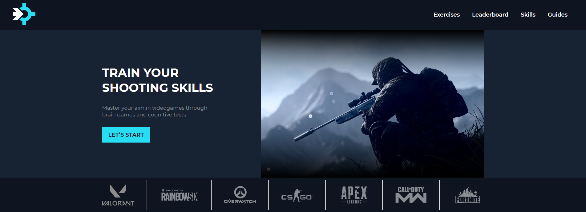
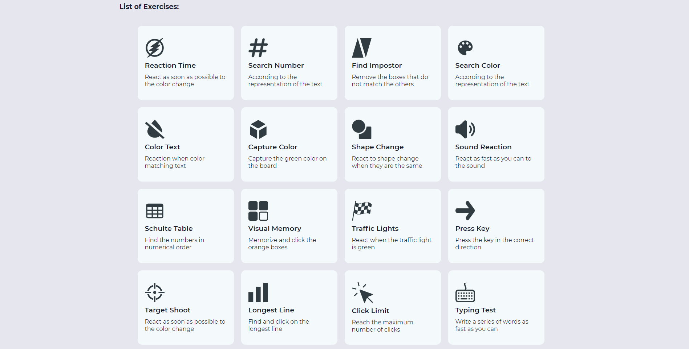

<p align="center">
   
</p>

# Aim-Max

[](https://github.com/JuanGabrielTL)
[](#)
[](#)

> Master your aim in videogames through brain games and cognitive tests.

<br />
<p align="center"></p>
<p align="center"></p>
<p align="center"></p>

---

# :pushpin: Table of Contents

* [Features](#rocket-features)
* [Installation](#construction_worker-installation)
* [Getting Started](#runner-getting-started)
* [FAQ](#postbox-faq)
* [Found a bug?](#bug-issues)
* [License](#closed_book-license)


# :rocket: Features

* 🔫 Master your aim in videogames.
* ⚔️ We have 16 different exercises.
* 🧠 Improve your cognitive ability.
* 📨 Save your scores and enter to the leaderboard.
* 🌏 Multi language support - English and Spanish.

# :construction_worker: Installation

**You need to install [Node.js](https://nodejs.org/en/download/) first, then in order to clone the project via HTTPS, run this command:**

```git clone https://github.com/JuanGabrielTL/Aim-Max.git```

**Install dependencies**

```npm install```

# :runner: Getting Started

## Available Scripts

In the project directory, you can run:

### `npm start`

Runs the app in the development mode.\
Open [http://localhost:3000](http://localhost:3000) to view it in the browser.

The page will reload if you make edits.\
You will also see any lint errors in the console.

### `npm run server`

npm run server: start to run the server by default in port 7000,
if you edit some code it will update like npm start but this work in back-end, 
server all time read dist/index.html, so if you make changes in the frontend
make sure you updated with npm run build.

### `npm test`

Launches the test runner in the interactive watch mode.\
See the section about [running tests](https://facebook.github.io/create-react-app/docs/running-tests) for more information.

### `npm run build`

Builds the app for production to the `build` folder.\
It correctly bundles React in production mode and optimizes the build for the best performance.

The build is minified and the filenames include the hashes.\
Your app is ready to be deployed!

See the section about [deployment](https://facebook.github.io/create-react-app/docs/deployment) for more information.

### `npm run eject`

**Note: this is a one-way operation. Once you `eject`, you can’t go back!**

If you aren’t satisfied with the build tool and configuration choices, you can `eject` at any time. This command will remove the single build dependency from your project.

Instead, it will copy all the configuration files and the transitive dependencies (webpack, Babel, ESLint, etc) right into your project so you have full control over them. All of the commands except `eject` will still work, but they will point to the copied scripts so you can tweak them. At this point you’re on your own.

You don’t have to ever use `eject`. The curated feature set is suitable for small and middle deployments, and you shouldn’t feel obligated to use this feature. However we understand that this tool wouldn’t be useful if you couldn’t customize it when you are ready for it.

# :postbox: Faq

**Question:** What are the technologies used in this project?

**Answer:** The tecnologies used in this project are [NodeJS](https://nodejs.org/en/) + [Express Framework](http://expressjs.com/en/) to handle the server, [React](https://es.reactjs.org/) to build user interfaces and interactivity & [Mongoose](https://mongoosejs.com/) to save the names and scores of the players, as well as to build the leadeboard.
##

**Question:** Are all types of users able to play and save their scores?

**Answer:** Yes, you really don't need to log in to enjoy the website, all you need is a computer. After finishing a minigame, the site asks you if you want to save your score and you can save it without the need for an email, or anything like that, just with your name.


# :bug: Issues

Feel free to **file a new issue** with a respective title and description on the the [Aim-Max](https://github.com/JuanGabrielTL/Aim-Max/pulls) repository. If you already found a solution to your problem, **i would love to review your pull request**!

# :closed_book: License

Released in 2021.
This project is under the [MIT license](https://github.com/JuanGabrielTL/Aim-Max/blob/main/LICENSE.txt).

Made by [Juan Gabriel Tavárez López](https://github.com/JuanGabrielTL) 🤠
